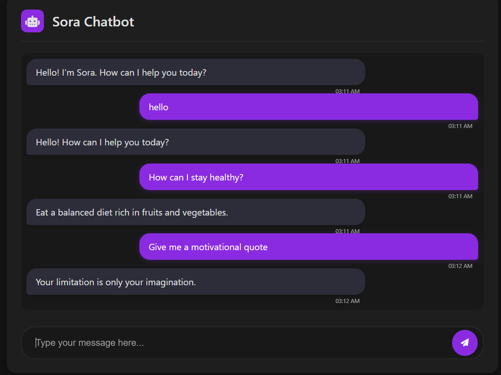

# 🤖 Sora – Intent-based AI Chatbot with FastAPI


[Sora](https://github.com/m7md158/Sora) is an Intent-based AI Chatbot chatbot web app built using **FastAPI**, **PyTorch**, and **Natural Language Processing (NLP)**. It uses a trained neural network model to classify user input and respond with relevant answers based on predefined intents.

## 🚀 Features

- FastAPI web interface with Jinja2 templates
- TF-IDF vectorization for text input
- Neural network model built in PyTorch
- Tokenization, lemmatization, and stopword filtering using NLTK
- Modular code structure and easy-to-train pipeline

## 🧠 Tech Stack

- [FastAPI](https://fastapi.tiangolo.com/)
- [PyTorch](https://pytorch.org/)
- [NLTK](https://www.nltk.org/)
- [scikit-learn](https://scikit-learn.org/)
- [Jinja2](https://jinja.palletsprojects.com/)
- [tqdm](https://tqdm.github.io/), NumPy

## 📁 Project Structure


---

## 📂 File Explanations

| File / Folder        | Description |
|----------------------|-------------|
| `chat.py`            | The main FastAPI application. Handles routes, loads the trained model, processes user input, and returns chatbot responses. |
| `model.py`           | Defines the structure of the neural network used for intent classification (PyTorch model). |
| `nltk_utils.py`      | Contains NLP helper functions like `tokenize()` and `lemmatize_word()` for cleaning and preprocessing user input. |
| `intents.json`      | JSON file containing training data for the chatbot: a list of intents, each with sample patterns (user phrases) and possible responses.
| `Preprocessing.py`   | Loads training data, initializes the TF-IDF vectorizer, and prepares input/output data (`X`, `y`, `tags`, `all_words`). |
| `templates/index.html` | Jinja2 HTML template used to render the chatbot interface in the browser. |
| `model.pth`          | Saved weights of the trained neural network model (used for inference). |
| `requirements.txt`   | List of Python dependencies needed to run the project. |
| `README.md`          | This file – documentation and instructions for using the project. |

---

## ⚙️ Installation

1. Clone the repository:
```bash
 git clone https://github.com/m7md158/Sora.git
   cd Sora
```

## Create a virtual environment:

```bash
python -m venv venv

venv\Scripts\activate

pip install -r requirements.txt
```

## 🧪 Running the App

```bash
uvicorn main:app --reload

```
## 🧠 Example Use

User: Hello!
Chatbot: Hi there! How can I help you today?

## 🎬 Demo


